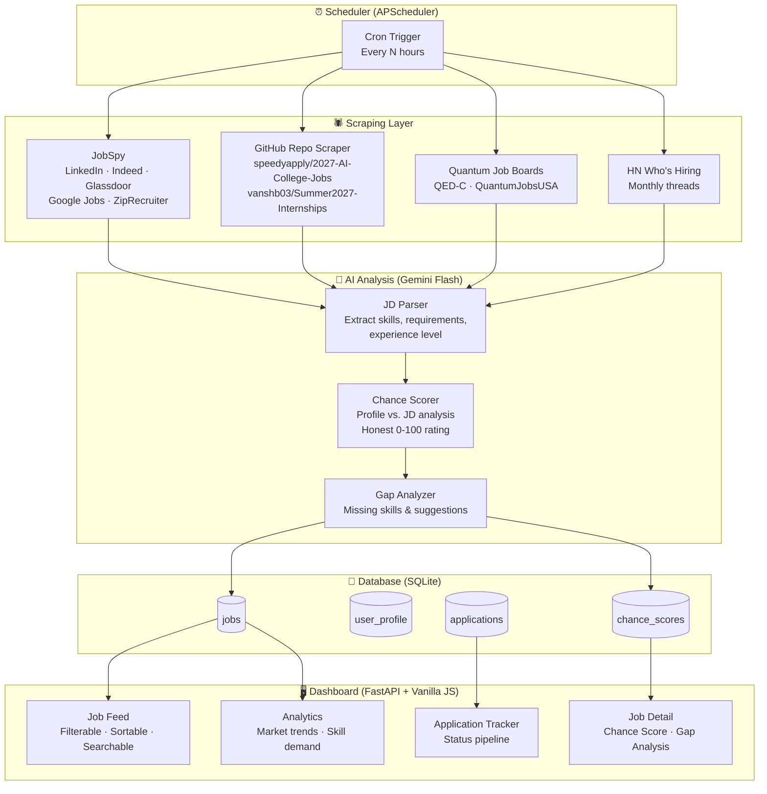

# Employmentmaxxing — AI-Powered Job Tracker

A free, self-hosted web application that scrapes AI/ML/SWE/Quantum internship and co-op postings multiple times daily, displays them on a sleek dashboard, and provides honest, analytical "chance scoring" — all without needing a custom resume.

---

## User Review Required

> [!IMPORTANT]
> **Technology Stack Decision**: The plan below proposes a **Python backend (FastAPI)** + **vanilla HTML/CSS/JS frontend** architecture. This keeps it lightweight, free to host, and avoids framework complexity. If you'd prefer React/Next.js or a full SPA framework, let me know.

> [!IMPORTANT]
> **AI Provider**: The plan uses the **Gemini Flash free tier** (~1,500 requests/day) for job description analysis and chance scoring. This is enough for a personal tracker processing ~50-100 new jobs per scrape cycle. If you'd prefer a fully local/offline LLM (e.g., Ollama), we can adjust.

> [!WARNING]
> **Scraping Legality**: Web scraping of public job data is generally legal in the US (per *hiQ v. LinkedIn*), but violates most sites' Terms of Service. This tool is designed for **personal use only**. We will respect `robots.txt`, use reasonable rate limits, and avoid scraping login-walled content.

---

## Open Questions

1. **Hosting preference?** The app can run:
   - **Locally only** (just `python main.py` and open `localhost`) — simplest
   - **On a free VPS** (e.g., Oracle Cloud free tier, Railway, Render) — always-on
   - **Your own server** if you have one
   
2. **Notification preferences?** Should the app alert you when high-match jobs appear?
   - Email notifications (via free SMTP like Gmail)
   - Discord webhook
   - Browser push notifications
   - None — I'll just check the dashboard

3. **Profile depth**: The "chance score" needs to know your skills. Should this be:
   - A one-time profile form in the dashboard (name, skills, GPA range, projects, etc.)
   - A JSON/YAML config file you edit manually
   - Both (form that writes to config)

4. **Scrape frequency**: "Multiple times daily" — are you thinking:
   - Every 4 hours (6x/day) — balanced
   - Every 2 hours (12x/day) — aggressive
   - Every 6 hours (4x/day) — conservative

---

## Architecture Overview



---

## Proposed Changes

### Component 1: Project Structure

```
employmentmaxxing/
├── backend/
│   ├── main.py                    # FastAPI app + server entry
│   ├── config.py                  # Settings, API keys, scrape schedule
│   ├── database.py                # SQLite setup + models
│   ├── scheduler.py               # APScheduler cron jobs
│   ├── scrapers/
│   │   ├── __init__.py
│   │   ├── jobspy_scraper.py      # Indeed/LinkedIn/Glassdoor/Google Jobs
│   │   ├── github_scraper.py      # Community repos (speedyapply, etc.)
│   │   ├── quantum_scraper.py     # Quantum-specific job boards
│   │   ├── hn_scraper.py          # Hacker News Who's Hiring
│   │   └── deduplicator.py        # Cross-source deduplication
│   ├── analysis/
│   │   ├── __init__.py
│   │   ├── jd_parser.py           # Extract structured data from JDs
│   │   ├── chance_scorer.py       # Profile-vs-JD scoring engine
│   │   └── skill_taxonomy.py      # Canonical skill mapping
│   ├── routes/
│   │   ├── __init__.py
│   │   ├── jobs.py                # Job listing API endpoints
│   │   ├── profile.py             # User profile CRUD
│   │   ├── applications.py        # Application tracking endpoints
│   │   └── analytics.py           # Stats and trends endpoints
│   └── requirements.txt
├── frontend/
│   ├── index.html                 # Main dashboard SPA
│   ├── css/
│   │   └── style.css              # Dark theme, glassmorphism design system
│   ├── js/
│   │   ├── app.js                 # Main application logic
│   │   ├── components/
│   │   │   ├── jobCard.js         # Individual job listing card
│   │   │   ├── jobDetail.js       # Expanded job view + score
│   │   │   ├── filters.js         # Search/filter sidebar
│   │   │   ├── tracker.js         # Application pipeline board
│   │   │   ├── profile.js         # Profile editor
│   │   │   └── analytics.js       # Charts and trends
│   │   └── utils/
│   │       ├── api.js             # API client wrapper
│   │       └── charts.js          # Chart.js wrapper
│   └── assets/
│       └── logo.svg
└── README.md
```

---

### Component 2: Scraping Layer

#### [NEW] `backend/scrapers/jobspy_scraper.py`
The primary scraper using `python-jobspy`. Handles 5 major job boards in one call:
- **Search queries**: Rotates through queries like `"AI ML intern"`, `"machine learning co-op"`, `"software engineer intern 2027"`, `"quantum computing intern"`
- **Filters**: Entry-level only, posted within last 24h (to avoid re-scraping old jobs)
- **Output**: Normalized DataFrame → SQLite insertion
- **Rate limiting**: 2-second delay between queries, max 10 queries per cycle

#### [NEW] `backend/scrapers/github_scraper.py`
Scrapes community-maintained GitHub repos via raw markdown/JSON:
- `speedyapply/2027-AI-College-Jobs` — AI/ML focused, daily updates
- `speedyapply/2027-SWE-College-Jobs` — SWE roles
- `vanshb03/Summer2027-Internships` — Broad tech internships
- Parses markdown tables → extracts company, role, location, link, date
- Runs diff against last known state to detect new additions

#### [NEW] `backend/scrapers/quantum_scraper.py`
Lightweight scraper for niche quantum boards:
- QED-C job board (quantumconsortium.org)
- Quantum Jobs USA (quantumjobs.us)
- IBM Quantum careers page (filtered for intern/student roles)
- Uses `requests` + `BeautifulSoup` since these are simpler sites

#### [NEW] `backend/scrapers/hn_scraper.py`
Monthly Hacker News "Who's Hiring" thread parser:
- Uses HN Algolia API (free, official, no scraping needed)
- Filters comments containing keywords: `intern`, `co-op`, `AI`, `ML`, `quantum`, `junior`, `new grad`
- Extracts company name, role info, and apply link from comment text

#### [NEW] `backend/scrapers/deduplicator.py`
Cross-source deduplication engine:
- **Company + Title fuzzy match** using `rapidfuzz` (Levenshtein distance)
- **URL normalization** to catch same job posted across boards
- Merges duplicates, preserves the richest description, tags all source boards

---

### Component 3: AI Analysis Engine

#### [NEW] `backend/analysis/jd_parser.py`
Uses Gemini Flash to extract structured data from raw job descriptions:

```python
# Output schema per job
{
    "required_skills": ["Python", "PyTorch", "TensorFlow"],
    "preferred_skills": ["Kubernetes", "AWS"],
    "experience_level": "intern",          # intern | co-op | junior | mid
    "education_required": "pursuing BS/MS in CS",
    "years_experience": 0,                 # 0 for interns
    "is_remote": true,
    "visa_sponsorship": "unknown",         # yes | no | unknown
    "team_focus": "Computer Vision",
    "tech_stack": ["Python", "PyTorch", "Docker"],
    "red_flags": [],                       # e.g., "unpaid", "requires 3+ years for intern"
    "green_flags": ["mentorship", "return offer potential"]
}
```

#### [NEW] `backend/analysis/chance_scorer.py`
The core innovation — honest, explainable chance assessment:

**Scoring Algorithm (Weighted, Deterministic + AI Hybrid)**:

| Factor | Weight | How It's Measured |
|--------|--------|-------------------|
| **Skill Match** | 35% | % of required skills you have |
| **Education Fit** | 15% | Degree level + major alignment |
| **Experience Level** | 15% | Intern/co-op targeting match |
| **Preferred Skill Bonus** | 10% | % of "nice-to-have" skills |
| **Competition Estimate** | 10% | Company prestige × posting age |
| **Location/Remote Fit** | 10% | Your location vs. job requirements |
| **AI Holistic Assessment** | 5% | Gemini's qualitative read |

**Output per job**:
```python
{
    "overall_score": 72,           # 0-100
    "verdict": "Strong Match",     # "Reach" | "Worth a Shot" | "Strong Match" | "Safety"
    "skill_breakdown": {
        "matched": ["Python", "PyTorch", "Git"],
        "missing": ["Kubernetes"],
        "bonus_matched": ["TensorFlow"]
    },
    "honest_take": "You meet 3/4 required skills and your quantum computing background is a differentiator. The missing Kubernetes experience is learnable and rarely a hard filter for interns. Apply — your profile is competitive.",
    "improvement_tips": [
        "Add a Kubernetes project to your GitHub",
        "Highlight any relevant coursework in distributed systems"
    ],
    "apply_priority": "HIGH"       # LOW | MEDIUM | HIGH | CRITICAL
}
```

> [!NOTE]
> **Why "honest"?** The scorer intentionally avoids flattery. If you're missing 3 out of 4 required skills for a senior role, it will tell you it's a reach — but still explain what would need to change. No false hope, no unnecessary discouragement.

#### [NEW] `backend/analysis/skill_taxonomy.py`
Canonical skill mapping to avoid mismatches:
```python
SKILL_ALIASES = {
    "pytorch": "PyTorch",
    "tf": "TensorFlow", "tensorflow": "TensorFlow",
    "react.js": "React", "reactjs": "React",
    "ml": "Machine Learning",
    "k8s": "Kubernetes",
    "qiskit": "Qiskit",
    "cirq": "Cirq",
    "pennylane": "PennyLane",
    # ... 200+ mappings
}
```

---

### Component 4: Database Schema

#### [NEW] `backend/database.py`

**SQLite** (zero-config, single file, perfect for personal use):

```sql
-- Core job listing
CREATE TABLE jobs (
    id TEXT PRIMARY KEY,              -- SHA256(company + title + location)
    title TEXT NOT NULL,
    company TEXT NOT NULL,
    location TEXT,
    is_remote BOOLEAN,
    description TEXT,
    apply_url TEXT,
    salary_min INTEGER,
    salary_max INTEGER,
    date_posted DATE,
    date_scraped DATETIME,
    source TEXT,                       -- "indeed", "linkedin", "github_repo", etc.
    all_sources TEXT,                  -- JSON array of all sources found
    experience_level TEXT,             -- "intern", "co-op", "junior", "new_grad"
    job_type TEXT,                     -- "AI/ML", "SWE", "Quantum", "Data Science"
    is_active BOOLEAN DEFAULT TRUE,
    raw_data TEXT                      -- Full scraped JSON for debugging
);

-- Structured analysis from Gemini
CREATE TABLE job_analysis (
    job_id TEXT PRIMARY KEY REFERENCES jobs(id),
    required_skills TEXT,              -- JSON array
    preferred_skills TEXT,             -- JSON array
    education_required TEXT,
    years_experience INTEGER,
    tech_stack TEXT,                    -- JSON array
    visa_sponsorship TEXT,
    red_flags TEXT,                     -- JSON array
    green_flags TEXT,                   -- JSON array
    analyzed_at DATETIME
);

-- Your profile (single row)
CREATE TABLE user_profile (
    id INTEGER PRIMARY KEY DEFAULT 1,
    name TEXT,
    university TEXT,
    graduation_year INTEGER,           -- 2027
    degree TEXT,                        -- "BS Computer Science"
    gpa_range TEXT,                     -- "3.5-4.0" (optional, for self-assessment)
    skills TEXT,                        -- JSON array: ["Python", "PyTorch", ...]
    projects TEXT,                      -- JSON array of {name, description, tech_stack}
    preferred_locations TEXT,           -- JSON array
    open_to_remote BOOLEAN,
    target_roles TEXT,                  -- JSON: ["AI/ML", "SWE", "Quantum"]
    additional_context TEXT             -- Free text: "I've published a paper on X"
);

-- Chance scores
CREATE TABLE chance_scores (
    job_id TEXT PRIMARY KEY REFERENCES jobs(id),
    overall_score INTEGER,             -- 0-100
    verdict TEXT,
    skill_match_pct REAL,
    education_fit REAL,
    experience_fit REAL,
    competition_estimate REAL,
    honest_take TEXT,
    improvement_tips TEXT,              -- JSON array
    apply_priority TEXT,               -- LOW | MEDIUM | HIGH | CRITICAL
    scored_at DATETIME
);

-- Application tracking
CREATE TABLE applications (
    id INTEGER PRIMARY KEY AUTOINCREMENT,
    job_id TEXT REFERENCES jobs(id),
    status TEXT DEFAULT 'interested',   -- interested → applied → screening → interview → offer → rejected
    applied_date DATE,
    notes TEXT,
    follow_up_date DATE,
    response_received BOOLEAN DEFAULT FALSE,
    updated_at DATETIME
);
```

---

### Component 5: Backend API

#### [NEW] `backend/main.py`
FastAPI application serving both the API and static frontend:

**Key endpoints**:

| Method | Endpoint | Description |
|--------|----------|-------------|
| `GET` | `/api/jobs` | List jobs with filters (type, score, date, source) |
| `GET` | `/api/jobs/{id}` | Full job detail + analysis + chance score |
| `GET` | `/api/jobs/stats` | Aggregated analytics (skill demand, etc.) |
| `POST` | `/api/profile` | Create/update user profile |
| `GET` | `/api/profile` | Get current profile |
| `GET` | `/api/applications` | List tracked applications |
| `POST` | `/api/applications` | Add job to application tracker |
| `PATCH` | `/api/applications/{id}` | Update application status |
| `POST` | `/api/scrape/trigger` | Manually trigger a scrape cycle |
| `GET` | `/api/scrape/status` | Check last scrape time + stats |

---

### Component 6: Frontend Dashboard

A single-page dark-themed dashboard with glassmorphism design language.

#### Dashboard Layout (5 views):

**1. Job Feed (Main View)**
- Card grid of scraped jobs, each showing:
  - Company logo (fetched via Clearbit free API or fallback initials)
  - Job title, company, location
  - Chance score badge (color-coded: 🔴 0-30, 🟡 31-60, 🟢 61-80, 💎 81-100)
  - Tags: `AI/ML` `Remote` `Intern` `Co-op`
  - "Quick Apply" button (opens apply URL in new tab)
  - "Track" button (adds to application pipeline)
- Sidebar filters: Job type, score range, location, source, date posted
- Sort by: Chance score, date posted, company name

**2. Job Detail Modal**
- Full job description (rendered markdown)
- Chance Score breakdown with radial chart
- Skill gap analysis (matched ✅ vs missing ❌)
- "Honest Take" paragraph from the AI
- Improvement tips as actionable cards
- Apply button + track button

**3. Application Tracker (Kanban Board)**
- Drag-and-drop columns: `Interested` → `Applied` → `Screening` → `Interview` → `Offer` / `Rejected`
- Each card shows company, role, chance score, and days since action
- Add notes and follow-up reminders

**4. Profile Editor**
- Form to input/edit your skills, projects, preferences
- Skills as a tag input with autocomplete from the taxonomy
- Live preview of how your profile matches against recent jobs

**5. Analytics Dashboard**
- **Skill Demand Heatmap**: Which skills appear most in your target jobs
- **Score Distribution**: Histogram of your chance scores across all jobs
- **Market Pulse**: New jobs per day trend line
- **Source Performance**: Which boards produce the most relevant results
- **Application Funnel**: Conversion rates through your pipeline

---

### Component 7: Scheduler & Automation

#### [NEW] `backend/scheduler.py`
Uses APScheduler for automated scraping cycles:

```python
# Configurable schedule (default: every 4 hours)
scheduler.add_job(run_full_scrape, 'interval', hours=4)

# Pipeline per cycle:
# 1. Scrape all sources (parallel with ThreadPoolExecutor)
# 2. Deduplicate new results against existing DB
# 3. Run Gemini analysis on new jobs only (conserve API quota)
# 4. Score new jobs against user profile
# 5. Log scrape stats (jobs found, new, duplicates, errors)
```

---

## Tech Stack Summary

| Layer | Technology | Cost |
|-------|-----------|------|
| **Language** | Python 3.11+ | Free |
| **Web Framework** | FastAPI | Free |
| **Job Scraping** | python-jobspy, requests, BeautifulSoup | Free |
| **AI Analysis** | Gemini Flash (free tier, ~1500 req/day) | Free |
| **Database** | SQLite | Free |
| **Scheduler** | APScheduler | Free |
| **Frontend** | Vanilla HTML/CSS/JS + Chart.js | Free |
| **Deduplication** | rapidfuzz | Free |
| **Hosting** | Local / free VPS tier | Free |

**Total cost: $0**

---

## Verification Plan

### Automated Tests
```bash
# Unit tests for scrapers (mock responses)
pytest backend/tests/test_scrapers.py -v

# Unit tests for chance scorer
pytest backend/tests/test_scorer.py -v

# Integration test: full scrape → analyze → score cycle
pytest backend/tests/test_pipeline.py -v

# API endpoint tests
pytest backend/tests/test_api.py -v
```

### Manual Verification
1. Run a full scrape cycle and verify jobs appear in the dashboard
2. Fill out profile and verify chance scores are reasonable and honest
3. Test the application tracker drag-and-drop flow
4. Verify deduplication catches the same job across Indeed + LinkedIn
5. Confirm Gemini API stays within free tier limits over a 24h period
6. Check that the dashboard is responsive and looks great on mobile

---

## Implementation Phases

### Phase 1: Foundation (Core Backend)
- Project setup, database schema, FastAPI skeleton
- User profile CRUD
- JobSpy scraper with basic deduplication

### Phase 2: Intelligence (AI Layer)
- Gemini Flash integration for JD parsing
- Chance scoring algorithm
- Skill taxonomy and gap analysis

### Phase 3: Dashboard (Frontend)
- Dark theme design system
- Job feed with filters and cards
- Job detail modal with score breakdown
- Profile editor form

### Phase 4: Tracking & Automation
- Application tracker kanban board
- APScheduler integration
- GitHub repo scraper + quantum board scrapers

### Phase 5: Analytics & Polish
- Analytics dashboard with charts
- HN Who's Hiring scraper
- Notifications (if desired)
- Mobile responsiveness polish
